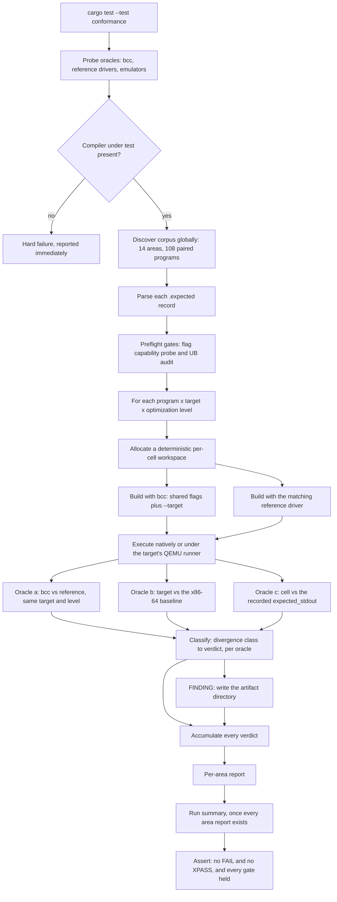

# Differential Conformance Testing

How `bcc` is judged against authorities other than itself — three oracles, a 14-area corpus of 108
hand-authored C programs, a closed six-verdict space with no silent-skip path, and a run summary
that reports every outcome it reached.

This page is the methodology reference for the suite that lives in `tests/conformance/`. The suite's
own [contract](../../tests/conformance/README.md) is the binding specification for its file formats
and its harness behaviour; this page explains *why* the suite is shaped the way it is, and is the
single place that carries the full command catalogue, the full environment-variable table, the build
matrix, the verdict taxonomy and the deliverable summary format.

---

## Purpose and methodology

**Differential testing is the standard compiler oracle.** Compile and execute one program with two or
more compilers, or at two or more optimization levels, and require identical results. A difference is
then evidence of a defect in one of them, without anyone having had to write down in advance what the
right answer was. That is the whole method, and it is what lets a test suite discover a class of wrong
answers nobody anticipated.

**Freedom from undefined and unspecified behaviour is the precondition that makes the oracle sound.**
If a program contains undefined behaviour, a difference between two compilers proves nothing about
either, because both are permitted to do anything at all. The conclusion "one of these compilers is
wrong" is only available when the program has exactly one permitted meaning. The suite therefore
**machine-enforces** that property rather than asserting it — see
[the undefined-behaviour audit gate](#the-undefined-behaviour-audit-gate) — and every program
additionally carries a written argument for its own freedom from undefined behaviour.

### The gap this fills

The repository already executes compiled output on four architectures, so the gap is narrower and
more specific than "no execution testing". Stated precisely, against the inventory in
`docs/project-guide.md` §3:

| Existing suite | What it asserts | What it cannot detect |
|---|---|---|
| `tests/multiarch.rs` (24) and `tests/hello_world.rs` (12) | Compile and execute on all four targets under QEMU, against **hard-coded literal expectations** for a handful of programs | A wrong answer the expectation was not written to anticipate |
| `tests/optimization.rs` (31) | That constant folding, dead-code elimination and common-subexpression elimination **occur** | Whether they **preserved semantics** — occurrence is a property of the optimizer's implementation, not of its correctness |
| `tests/codegen_x86_64.rs` (44), `codegen_i686.rs` (40), `codegen_aarch64.rs` (29), `codegen_riscv64.rs` (34) | Instruction selection, ABI adherence and register allocation, **one architecture at a time** | A disagreement between the four backends' **results**, which is exactly where an ABI or calling-convention defect surfaces |
| `tests/cli.rs` (43) | `bcc`'s own flag parsing, exit codes and output naming | Whether a flag means the **same thing** to another compiler |
| `tests/validation/*.rs` (68, of which 13 ignored) | That large real-world C projects **build** | Behavioural equivalence — a build-success oracle is not an output oracle |

**None of those shapes can detect a wrong-but-consistent answer. An independent oracle can.** That is
the one capability this suite adds, and it is added alongside the existing suites rather than in place
of any of them: **no existing test file is edited, and no `#[ignore]` attribute is added or removed
anywhere in the repository.**

The suite closes the repository's own open work item **"C11 Standard Corner Case Compliance Testing"**
(`docs/project-guide.md` §2.2 — 5 h, Medium) and directly addresses the open risk **"C11 corner case
non-compliance — edge cases in complex declarators and type conversions may remain — Requires targeted
testing"** (§6). The risk's status stays **Open**: this suite reports, it does not repair. A divergence
it finds becomes a deliverable, never a patch.

### Two deliberate exclusions, recorded as decisions

- **Random program generation and fuzzing are excluded.** The requirement is broad coverage *rather
  than where problems are expected*, which mandates systematic feature enumeration, not adversarial
  search. The corpus is hand-authored and fully deterministic, which additionally makes every finding
  human-readable on sight rather than after reduction.
- **Error detection — correctly *rejecting* invalid programs — is a noted non-goal.** Both mandated
  oracles require the program to compile and run successfully before anything can be compared, so an
  invalid program produces no comparable output. It is a valuable future axis, and naming it here is
  what makes its absence a decision rather than an oversight.

The framing throughout is **black-box**. No test in the suite imports a compiler module or inspects an
intermediate representation: the unit under test is the `bcc` binary as a whole, exercised through its
command-line interface and judged solely by the observable behaviour of the programs it produces.
Every white-box concern is already covered by the existing suites and is deliberately not duplicated.

---

## The three oracles

Two oracles are mandated by the requirements. The third costs nothing and closes a hole the first two
structurally cannot reach.

| Oracle | Compares | Detects | Volume |
|---|---|---|---|
| **(a) Reference compiler** | `bcc` against a reference C compiler, **same target, same optimization level** | A wrong answer `bcc` produces **consistently** across all four of its backends | **324** native comparisons plus **up to 972** cross |
| **(b) Cross-backend** | Each non-baseline target against the **x86-64 baseline** at the same optimization level | A wrong answer confined to **one** backend — an ABI, register-allocation or instruction-selection defect | **972** comparisons |
| **(c) Golden record** | Every cell against the `expected_stdout` recorded in the program's own co-located `.expected` record | **Both** compilers moving in the same direction, which oracle (a) still reports as agreement — plus toolchain drift and regression over time | **1,296** assertions |

**x86-64 is oracle (b)'s baseline because it is the host architecture**, so its execution involves no
emulator and therefore no emulation-related variable. The other three targets execute under **QEMU
user-mode emulation**, which is why every artifact is statically linked: a self-contained binary needs
no sysroot and no dynamic-loader configuration.

**Oracle (c) is what makes "source file, build commands, and expected output recorded together"
literally true.** It is also the only one of the three that can catch two compilers changing behaviour
together — the single failure mode pure differential testing cannot see, because agreement is exactly
what it reports in that case.

Nothing is mocked, stubbed or simulated anywhere. The reference compiler, the emulators, the system C
runtime and static `libc` are all used **for real**. Substituting any of them would return the
author's own expectation instead of an independent answer, which would defeat the oracle outright.
This matches the repository's documented testing model, which uses no mocking framework and no runtime
dependency injection.

---

## Comparison discipline

Comparison is deliberately narrow: **stdout bytes and exit status only.**

- **Standard error is captured and never compared.** Diagnostic wording legitimately differs between
  compilers, so comparing it would produce a flood of divergences that say nothing about code
  correctness. It is captured into finding artifacts, where it is frequently the fastest route to a
  diagnosis.
- **Exit-status comparison uses the raw wait status**, so termination by a signal is distinguished
  from a normal exit rather than conflated with it.
- **Expected exit codes are confined to 0–125**, because the operating system truncates larger values:
  `return 300` was measured as status **44**. A fired timeout bound is named before any comparison, so
  a `timeout` status is never read as a program's own.

Byte-exact comparison is only meaningful against deterministic output, so the corpus obeys a fixed set
of determinism rules:

- **no address or pointer value is ever printed** — pointer facts appear only as differences,
  comparisons and alignment residues;
- no timestamps, no randomness, no reads of uninitialized storage, no locale-dependent formatting;
- iteration order is fixed everywhere;
- floating-point values print at **fixed precision with margin**, a rule validated by measurement —
  the same results printed byte-identically across all twelve target-and-optimization configurations.

---

## The build matrix

**14 feature areas · 108 programs · 3 optimization levels (`-O0`, `-O1`, `-O2`) · 4 targets (x86-64,
i686, AArch64, RISC-V 64) = 1,296 `bcc` compile-and-run cells**, plus **324** native and **up to 972**
cross reference-compiler cells, producing **3,564 verdict outcome rows**.

| Quantity | Figure | Arithmetic |
|---|---|---|
| Feature areas | 14 | directories `01_…` through `14_…` |
| Programs, each paired 1:1 with an expectation record | 108 | the per-area counts below, which sum to 108 |
| `bcc` compile-and-run cells | **1,296** | 108 × 4 × 3 |
| Reference cells, native | **324** | 108 × 3 |
| Reference cells, cross | up to **972** | 108 × 3 × 3, reached when all three cross drivers are installed |
| Oracle (a) comparisons | **1,296** | 324 native + 972 cross |
| Oracle (b) verdict rows | **972** | 108 × 3 levels × 3 non-baseline targets |
| Oracle (c) assertions | **1,296** | one per `bcc` cell |
| **Verdict outcome rows** | **3,564** | 1,296 + 972 + 1,296 |
| Comparisons actually performed | **3,555** | 3,564 less the nine oracle (b) rows one record declines to make |

**An outcome row is not the same thing as a performed comparison, and the two are published
separately.** All 3,564 rows reach a verdict and appear in the summary; **3,555** of them are
comparisons that were actually made. The other nine are the oracle (b) rows of
`13_floating_point/004_long_double_target_restricted` — three non-baseline targets × three
optimization levels — whose record disables that oracle for a measured reason and whose marker
documents the narrowing. They are reported `XFAIL` as *not attempted*, which is neither a pass nor a
silent skip: nothing was compared, so no equality is claimed. Calling all 3,564 "assertions" would
credit the suite with nine comparisons it does not make.

### The 14 feature areas

Nine areas are the acceptance floor the requirements set, each carrying no fewer than six programs.
The five marked supplementary were added because they carry the widest cross-backend divergence
surface. The counts sum to 108 and every one is countable from the committed file set with a shell.

| Area | Programs | Mandate | Focus |
|---|---|---|---|
| `01_integer_conversions` | 10 | mandated | Integer promotions, usual arithmetic conversions, signedness and width, `_Bool`, unsigned wraparound, shift semantics, division and modulo signs |
| `02_constant_expressions` | 8 | mandated | Constant folding, constant-expression contexts, `_Static_assert`, `sizeof`/`_Alignof`, literal suffix typing, conditional and comma folding |
| `03_initializers` | 11 | mandated | Nested, partial with implicit zero fill, designated (array, struct, mixed), unions, string arrays, compound literals, flexible array member |
| `04_bitfields` | 7 | mandated | Layout and size, read and write, **compound assignment**, signed and unsigned extremes, straddling and zero-width separators, promotion |
| `05_pointers` | 10 | mandated | Arithmetic, differences and comparisons, multilevel indirection, function pointers, **function-pointer tables**, array decay, null semantics, qualifiers |
| `06_control_flow` | 10 | mandated | Selection, all three loop forms, switch fallthrough, switch edge cases, `break`/`continue` interaction, **short-circuit evaluation**, `goto`, comma sequencing |
| `07_variadics` | 6 | mandated | Default argument promotions, `va_copy` with multiple passes, forwarding, argument counts that force stack spill |
| `08_gcc_extensions` | 8 | mandated | Statement expressions, `typeof`, computed goto, **case ranges**, packing and alignment attributes, builtins, `__extension__`, per-target inline assembly |
| `09_optimization_levels` | 8 | mandated | Semantic **preservation** across `-O0`/`-O1`/`-O2`: arithmetic, loop, `volatile` side effect, CSE, inlining, switch lowering, struct copy, folded-versus-runtime equivalence |
| `10_declarations_and_types` | 10 | supplementary | Complex declarators, typedef scope, storage class and linkage, qualifiers, by-value struct copy and return, enums, `_Alignof`/`_Alignas`, `_Noreturn`, `_Generic`, anonymous aggregates |
| `11_literals_and_strings` | 4 | supplementary | Character escapes, string literal handling, wide and Unicode literals, width-normalized format specifiers |
| `12_preprocessor` | 6 | supplementary | Macro expansion and stringize, conditional compilation, **bundled-header inclusion**, predefined macros, variadic macros, `#pragma` and `#line` |
| `13_floating_point` | 4 | supplementary | Float and double arithmetic, float-to-integer conversions, finite comparisons only, **target-restricted `long double`** |
| `14_abi_calling_convention` | 6 | supplementary | Register-exhausting integer and float parameter counts, mixed classes, small and large struct passing, struct return by value, callee-saved preservation |
| **Total** | **108** | 9 mandated + 5 supplementary | |

**The highest-yield programs**, where the four backends have the most room to disagree:
`07/006_many_args_stack_spill`, `10/005_struct_copy_and_return`, `04/005_straddling_and_zero_width`,
`08/003_computed_goto`, and the whole of area 14.

### Levels, and the two that are absent

The optimization matrix is exactly `{-O0, -O1, -O2}`. **`-O3` and `-Os` are excluded**, and not as a
convenience: `docs/technical-specifications.md` §0.6.2 states verbatim *"`-O3` or higher optimization
levels | Only `-O0`, `-O1`, `-O2` are in scope"*, and `-Os` appears in no documented level list at
all. A level `bcc` does not implement cannot be compared with one the reference compiler does.

### Measured cost

Approximately **72.5 ms** per compile-and-run pair including emulator startup — 36 pairs completed in
2.612 s wall time. The full matrix is ≈**2,592** pairs (1,296 `bcc` + 324 native reference + 972 cross
reference), so ≈**188 s** serially, and well under a minute spread across the built-in harness's
default thread pool given 14 independent area tests. A per-cell timeout bounds any runaway execution.

---

## Why no coverage percentage is published

**No coverage percentage appears anywhere on this page, and none may be added.** Coverage
instrumentation requires a development dependency, and `docs/technical-specifications.md` §0.7 forbids
one absolutely. Nothing in this repository can measure a line-coverage figure, so publishing one would
be fabrication rather than reporting.

**The enumerable matrix above is this suite's coverage evidence.** Every figure in it is countable
directly from the committed file set with no tooling beyond a shell, and the run summary re-reports
the same figures on every execution. That makes it checkable by a reader, which a percentage nobody
can reproduce would not be.

Two facts about the repository's existing numbers make the choice consistent rather than exceptional.
The per-module figures in `docs/project-guide.md` §3 — the `~95%` down to `~80%` range — are
explicitly documented **estimates**, not measurements. And every existing `Integration —` and
`Validation —` row in that same table records its `Coverage %` as `N/A`, because integration coverage
was never instrumented either. This suite's row follows that established convention exactly.

The verifiable obligation the suite does impose is stronger than a percentage: **every one of the 108
programs must reach a verdict in every cell of its declared matrix.** A cell that does not run is
either an `UNAVAILABLE` — a genuinely missing oracle, reported loudly — or a failure. There is no path
by which a cell silently does not execute.

---

## The verdict taxonomy

The verdict space is closed and exhaustive. Every situation the harness can be in reaches exactly one
of these six verdicts; dropping a cell is not expressible.

| Verdict | Meaning | Effect on the run |
|---|---|---|
| **PASS** | This comparison agreed and no marker governs the cell | Run continues |
| **XFAIL** | A **marked expected divergence** citing a documented basis | Run continues; reported |
| **XPASS** | A marker is present but the divergence has **disappeared** | **The run FAILS** — the standard xunit convention that unexpected success is a failure |
| **FINDING** | An **undocumented** divergence; an artifact directory is written | Run continues — a finding is a deliverable, not a defect to patch |
| **FAIL** | Anything unexplained, including a comparison the suite could not honestly classify | **The run FAILS** |
| **UNAVAILABLE** | An oracle's tooling is **genuinely absent** from the environment | Reported **loudly** in the summary and **never** as a silent pass; a **failure** under `BCC_CONFORMANCE_STRICT` |

**Verdicts are rendered per oracle, not per cell.** Each enabled oracle renders its own verdict, so
one cell can carry up to three. A cell is passing only when **every** enabled oracle's outcome for it
is `PASS`; a cell whose oracle (a) agreed while its oracle (b) diverged is not a passing cell, and the
reports list the two outcomes separately rather than collapsing them. That separation is what lets a
divergence be attributed to the oracle that saw it.

**There is deliberately no "skip because unsupported" verdict.** The four verdicts permitted in a
passing run are `PASS`, `XFAIL`, `FINDING` and `UNAVAILABLE`, and each is still reported in full. The
two that fail the run are **`FAIL` and `XPASS`**. A **missing compiler under test is a hard failure**,
immediately and loudly — never an `UNAVAILABLE`, and never a skip.

### The three forms of XFAIL

All three are reported as `XFAIL`, none fails the run, and every one cites a marker — but they arise
from different directions and must not be confused.

| Form | What happened | Where the explanation lives |
|---|---|---|
| **Marker-covered divergence** | The comparison was made, it diverged, and an active marker covers this oracle, target, level **and** class | The marker in the program's own record, mirrored in the register |
| **Recorded exclusion** | The comparison was **not attempted**, because the record narrows its own coverage — an oracle switched off, a restricted target list, or a deviating warning gate | A marker whose scope names the narrowed oracle, **plus** the reasoned exclusion in that record's `impl_defined_notes`, printed in full in the report |
| **Dependent blocked arm** | A build produced no artifact, so this arm lost the subject of its comparison, and a marker on **another arm of the same cell** documents that one refusal | The root marker, cited by this arm's own detail, which states that no comparison was attempted here |

A recorded exclusion is deliberately **not** `UNAVAILABLE` and deliberately **not** `PASS`.
`UNAVAILABLE` is a statement about the *machine* — a tool nobody installed. A narrowing is a statement
about the *corpus* — an authoring decision, taken on the record. And nothing was compared, so no
equality may be claimed. The cell is still counted and still listed with its reason, which is what
keeps the set of comparisons deliberately **not** made as visible as the set that was.

### The six divergence classes

These are the legal values of a marker's `class` field, and every observed divergence is classified as
exactly one of them.

| Class | Meaning | Artifact |
|---|---|---|
| `compile_failure` | One compiler rejected a program the other accepted | none — a build refusal |
| `link_failure` | The program translated but did not link | none — a build refusal |
| `run_crash` | The program died on a signal instead of exiting | built and launched |
| `exit_code_mismatch` | Two completed runs disagreed on status | built and launched |
| `stdout_mismatch` | Two completed runs disagreed on bytes — the ordinary shape of a wrong answer | built and launched |
| `timeout` | An invocation outlived its budget | either, depending on which invocation it was |

The artifact column decides how a class propagates. A build refusal has no artifact, so one root event
denies all three oracle arms their subject at once and the dependent-blocked form above applies. The
other four are differences between two runs that actually happened, so only the arm that made the
comparison observed anything and nothing propagates.

**A timeout is a first-class divergence class, not an infrastructure error.** A program that
terminates promptly under one compiler and hangs under another is precisely the defect worth catching,
so it is classified and reported like any other divergence. A `link_failure` attributable to *this
machine* — an absent cross C runtime — is reported as `UNAVAILABLE` at environment scope and never as
a finding against the compiler.

### The unexpected-success policy

If a marker is present but the divergence it describes has gone, the verdict is **`XPASS` and the run
fails by default.** The justification is asymmetric cost: a stale marker is stale documented knowledge
that will mislead the next reader, while retiring it is a trivial test-only edit. Failing loudly is
the cheaper mistake.

`BCC_CONFORMANCE_ALLOW_XPASS` exists for a marker-retirement transition window and downgrades `XPASS`
to a warning. Either way `XPASS` is **always** listed separately and prominently in the summary, and
every detail names the marker and both places it must be retired from — the program's own `.expected`
record **and** the register — because a marker retired in one place and left in the other is still
stale documentation.

One precondition on retirement is worth stating, because it is easy to get backwards: a retirement
claims the divergence is gone, and only an observation from the **real** compiler under test supports
that. An agreement produced on a checkout that carries no `bcc` compares one toolchain with itself,
which measures the environment rather than the compiler and cannot retire a marker in either
direction.

---

## Expected divergences

A divergence that corresponds to a limitation the repository already documents is recorded as an
**expected divergence** rather than reported as a defect. The mechanism is deliberately built so that
the divergence and the program that provokes it can never drift apart.

**The marker lives inside the program's own `.expected` record.** It carries five required fields:

| Field | Content |
|---|---|
| `expected_divergence.id` | The stable identifier a report row cites |
| `expected_divergence.class` | One of the six divergence classes above |
| `expected_divergence.scope` | Which oracles, which targets and which optimization levels it applies to |
| `expected_divergence.basis` | The exact documenting artifact and locator — a file in this repository and a line or section inside it |
| `expected_divergence.observed` | The divergence as observed, in the past tense |

Two further fields, `expected_divergence.documented` and `expected_divergence.evidence`, are optional
enrichment. All five required fields must be present together or the block must be absent entirely.

**Every marker is mirrored in the committed register**
[`tests/conformance/EXPECTED_DIVERGENCES.md`](../../tests/conformance/EXPECTED_DIVERGENCES.md), and
the infrastructure test `infra_expected_divergence_register` asserts consistency **in both
directions** — every marker identifier appears in the register, every register entry corresponds to a
real marker, every field agrees character for character — **and** that every cited basis names a file
that actually exists in this repository, with its locator resolving inside that file. What the audit
deliberately does **not** establish is whether the cited passage *supports* the exclusion: that is a
reviewer's judgement, and the register says so per entry rather than implying otherwise.

**A marked program still compiles and still runs. A marker changes classification, never
participation.** Silent exclusion of a language feature is prohibited, and the prohibition is
mechanically enforced rather than trusted.

### The markers, and the candidate deliberately left unmarked

Two markers are active. The third candidate was analysed and left **unmarked** on purpose, and that
decision is as much a part of the design as the two that were minted.

| Candidate | Marker | Program | Documented basis | Verdict if it diverges |
|---|---|---|---|---|
| GCC case ranges | `XD-GCCEXT-CASE-RANGES-001` — class `compile_failure`, scope `oracle_a`, all targets, all levels | `08_gcc_extensions/004_case_ranges.c` | `docs/project-guide.md` line 206 — the documented GCC extension inventory enumerates the parsed extensions and **omits case ranges**. The identical seven-item list in `docs/technical-specifications.md` §0.7 and §0.1.1 — `__attribute__`, `__builtin_*` intrinsics, inline assembly with operand constraints, statement expressions, `typeof`/`__typeof__`, computed goto, `__extension__` — corroborates the omission | `XFAIL` on oracle (a) for a `compile_failure`, with oracles (b) and (c) reported as dependent blocked arms of the same root refusal; **`FINDING`** for a wrong answer, which the class does not cover |
| `long double` across the backends | `XD-TYPE-LONGDOUBLE-001` — class `stdout_mismatch`, scope `oracle_b`, all targets, all levels | `13_floating_point/004_long_double_target_restricted.c` | `docs/technical-specifications.md` line 511 — type representation is specified with target-parametric sizes covering the floating types, plus direct measurement: `sizeof(long double)` is **16 / 12 / 16 / 16**, the two x86 targets carrying the x87 80-bit extended format and the other two IEEE binary128 | `XFAIL` on the nine oracle (b) rows the record disables; **`FINDING`** on oracle (a) or (c), because nothing about representation excuses a same-target disagreement |
| Wide and Unicode literal prefixes | **none, deliberately** | `11_literals_and_strings/003_wide_and_unicode_literals.c` | The documented literal inventory in `docs/technical-specifications.md` does not enumerate the wide, UTF-8, 16-bit or 32-bit prefixes | **`FINDING`** — the correct outcome, not a compromise |

**Why the third candidate carries no marker, which is the instructive part.** The documentation gap is
real: nothing in `docs/` mentions those prefixes. But a gap in the documentation does not establish
that the frontend *rejects* them — these are standard C11 constructs rather than an extension, so a
C11 frontend plausibly handles them already. A speculative marker would then claim a divergence that
never existed, the comparison would agree, the verdict would be **`XPASS`**, and **the run would fail
on a mistake in the test material rather than a defect in the compiler**. Worse, the marker would
blind the suite to a genuine future regression in exactly that construct. The program is a full
participant with all three oracles enabled and all twelve cells scheduled; until an observation exists,
a divergence there is a finding, which is precisely what an undocumented divergence is defined to be.

### Handled by construction, not by marker

**A marker on a comparison that is still made implies a test that actually diverges.** Where a measured
implementation-defined difference is *designed around* so that no divergence occurs and the oracle that
would observe it stays enabled, a marker would be simply wrong — the comparison would agree and the
verdict would be `XPASS`. Two measured differences are therefore handled in the corpus itself, recorded
as `impl_defined_notes` in each affected program and in the register's own section:

- **plain-`char` signedness**, measured signed on x86-64 and i686 and **unsigned** on AArch64 and
  RISC-V 64 — avoided by using explicit `signed char` and `unsigned char` and never printing a value
  whose plain-`char` signedness matters;
- **`sizeof(long)` and pointer width**, measured 4 on i686 and 8 on the other three — avoided by width
  normalization, so no program's output depends on which target built it.

Both programs stay **fully compared on all four backends**, which is the property a marker would have
destroyed.

### Markers deliberately not created

Three documented limitations were considered as candidates and deliberately not turned into markers.
Recording the decision explicitly is how an omission stays a decision.

| Documented limitation | Why no marker |
|---|---|
| The shared-library and dynamic-loader validation gap — `docs/project-guide.md` §1.4 and §4, where `-shared` + `-fPIC` is marked ⚠️ as not end-to-end validated | **Outside this suite's oracles.** Every test binary is built with `-static`; no cell ever produces or loads a shared object, so the limitation cannot manifest here and a marker would describe a comparison the suite never makes |
| The DWARF debugger-validation gap — `docs/project-guide.md` §1.4 and §2.2, DWARF v4 not exercised with GDB or LLDB | **Outside this suite's oracles.** No debugger is ever invoked and `-g` appears in no differential invocation; the suite compares stdout bytes and exit status only, so debug information is never observed |
| Error detection — the rejection of invalid programs | **Not measurable by either mandated oracle**, as recorded above. A different kind of suite, not an expected divergence |

---

## Findings are deliverables, never patched

**No compiler source change is ever made in response to a finding.** That is the requirement and it is
also constraint C1; the two agree, so there is no tension to resolve. A divergence the repository does
not document becomes an artifact and a register entry, and the register
[`tests/conformance/FINDINGS.md`](../../tests/conformance/FINDINGS.md) indexes the set of them.

A curated finding is a self-contained directory under `tests/conformance/findings/F-NNNN-<slug>/`,
named by a human-allocated ascending sequence number and a slug naming the construct. **Seven
artifacts, all seven required** — a directory missing one is not a finding but a half-recorded
observation, and completeness is re-checked against disk immediately before any report advertises the
directory, so a row reading `FINDING` can never be an empty promise.

| Artifact | Content |
|---|---|
| `reproducer.c` | The program, minimized as far as practical while still provoking the divergence, and still bound by every corpus authoring rule |
| `reproducer.expected` | Its expectation record, so the finding stays **runnable by the harness** and can be re-checked over time rather than becoming a static curiosity |
| `MANIFEST.txt` | The finding identifier, the affected area and program, the divergence class, which oracles and which cells diverged, and a one-paragraph account of the observed difference |
| `commands.sh` | **Exact, copy-pasteable** compile and run lines for every cell involved, runnable with relative paths from inside the directory — this is what satisfies "the exact reproduction commands" **without the harness, without Cargo and without a Rust toolchain** |
| `outputs/<side>-<target>-<opt>.{stdout,exit,stderr}`, plus `.compile.{stdout,stderr,exit}` whenever there was a build | The captured output per side, where `<side>` is `bcc` for the compiler under test or the oracle's letter `a`, `b` or `c` for the authority it was judged against. Standard error is captured here even though it is never compared |
| `environment.txt` | The fingerprint: the `bcc` version, the reference compiler version, each cross-driver version, each emulator version and the kernel identification — which is what lets a divergence be attributed to **toolchain drift** rather than to the compiler |
| `diff.txt` | The computed difference, with the **first divergent line and byte offset** highlighted |

**The register is currently empty, and that is a factual statement rather than a placeholder.** No
undocumented divergence has been recorded, so `tests/conformance/findings/` holds nothing but its
`.gitkeep` — the directory is committed so that the first curated finding has a tracked home.

**Transient artifacts from each run are written beneath the build directory and are never committed**,
so an in-progress run cannot pollute the curated set. Minimization is manual or scripted; a system
reducer may be used **if present** but is never required, because adding one as a project dependency
is forbidden and the reproducer, commands, outputs and fingerprint do not depend on it. A run performs
no automated reduction, so a generated artifact carries a verbatim copy plus its recorded minimization
status rather than claiming a reduced program.

---

## The undefined-behaviour audit gate

Every program passes through two gates before any divergence it produces is allowed to mean anything.

**The warning gate:**

```text
-Wall -Wextra -pedantic -Wconversion -Wsign-conversion -Wshadow -Werror
```

**The sanitizer gate:**

```text
-fsanitize=undefined,address -fno-sanitize-recover=all
```

The sanitizer build is **dynamically linked** (no `-static`), **native only**, and then **actually
run** — an instrumented binary that is never executed establishes nothing.

**Both gates are applied only to the reference compiler, never to `bcc`.** Two independent reasons, and
both matter. First, `docs/technical-specifications.md` §0.6.2 lists *"Sanitizers (ASan, TSan, UBSan) |
Not supported"* for `bcc`. Second, the shared-flag discipline must stay untouched: a warning or
sanitizer flag in a differential invocation would be a flag only one of the two compilers honours.

**The sanitizer gate never renders a verdict about `bcc`.** It is a suite-authoring gate. A diagnostic
means the **test program** is defective and must be rewritten; the gate establishes the precondition
under which a `bcc` divergence is meaningful at all, and nothing more. The warning gate genuinely
bites rather than decorating — it rejected the author's own probe program on a real diagnostic during
design.

**There are exactly two sanctioned deviations**, each expressed as a removal from the fixed gate and
never as an addition, and each obliging the record to name the dropped flags with its reason:

| Deviation | Where | Why |
|---|---|---|
| Drop `-pedantic` | area `08_gcc_extensions` only | An extension is non-standard by definition, and `-pedantic` exists precisely to reject one |
| Drop `-Wconversion -Wsign-conversion` | `01_integer_conversions/004_narrowing_conversions` only | A narrowing conversion is the **behaviour under test**, not a mistake, and those diagnostics exist to catch an accidental one |

**`-Werror` can never be dropped**: a gate that warned without failing would be a gate in name only.
And **a deviation without a recorded reason is itself a defect in the test** — the record format
refuses to load a record that drops a flag without naming it.

Alongside the machine half, every program carries a **written undefined-behaviour-freedom argument** in
its record's `ub_notes`. That is the human half, and it is what a reviewer reads first when a
divergence appears; its presence is enforced by the record parser rather than merely encouraged.

The authoring rulebook the argument has to satisfy: no signed overflow; shift counts strictly within
range; no aliasing violations; no reads of uninitialized storage; one-past-end pointers may be
**formed but never dereferenced**; no object modified twice between sequence points; at most one
side-effecting argument per call; and no dependence on padding bytes or on the relative addresses of
unrelated objects.

**The volume.** Over 108 programs the audit produces **216 gate results** — 108 × 2 gates — performed
with **324 process invocations**, because a program costs three: one warning-gate compile, one
sanitizer build and one sanitizer run. `infra_ub_audit_gate` prints the expected and the performed
figures side by side and reconciles them, so a missing invocation is visible rather than inferred, and
every feature area asserts on the gates covering its own programs.

---

## Flag discipline

Only flags that both compilers honour with the same meaning may be passed identically to both — and
that is **verified rather than assumed**, by an executable probe that asserts an **observable
consequence** per flag rather than mere acceptance.

**The flags actually used in a differential invocation are deliberately minimal and unimpeachable:
`-o`, one of `-O0`/`-O1`/`-O2`, and `-static`.** The verified shared set is larger so that maintenance
has a proven envelope to work within, not because the suite currently needs all of it:

```text
-o  -c  -O0  -O1  -O2  -I  -D  -U  -L  -l  -g  -static  -fPIC
```

`infra_flag_capability_probe` verifies those **13** spellings and asserts, negatively, that none of
**27** further spellings has leaked into the shared set — the prohibited spellings enumerated below
plus concrete instantiations of the four that are prefix forms, because a table entry of `-std=` must
also exclude a `-std=c11` written out in full. It additionally asserts **6** structural properties of
the flag tables themselves, among them that the minimal differential set is contained in the verified
set, that every verified flag is actually covered by a check, and that per-side permission is
consistent. The probe prints all three figures, so they are checkable by running it rather than by
trusting this page. Representative observable checks:

| Flag | Observable verification |
|---|---|
| `-o NAME` | The named output file exists at the requested path |
| `-c` | The ELF type field at file offset `0x10` equals **1** — a relocatable object |
| `-static` | The type field equals **2** and **no interpreter program header** is present, contrasted with a default dynamic build's type **3** plus interpreter header |
| `-g` | A `.debug_info` section is present, asserted **present** with the flag and **absent** without it, so both directions of the claim are checked |
| `-I DIR` | A header reachable only through the probe directory is included successfully — **and the compile fails without `-I`**, which is the load-bearing half |
| `-D NAME=VAL` / `-U NAME` | The program prints the macro's value and the printed value changes as expected |
| `-O0` / `-O1` / `-O2` | Accepted by both, with program output unchanged across all three |
| `-L` / `-l` | **Acceptance only.** Full semantic verification would need an archive-creation tool, and the corpus links nothing but the C runtime, which is linked by default. The limitation is stated rather than glossed over |

The probe reads ELF identification bytes directly with the Rust standard library, so **`binutils` is
not a dependency** of this suite.

### The prohibitions, and the one that proves the method

- **No `-std` flag is ever passed.** `bcc` has none, and the reference compiler's default mode was
  measured as **gnu17** (`__STDC_VERSION__ = 201710L`, no `__STRICT_ANSI__`), which already enables
  the GNU extensions the corpus exercises. Because that mode cannot be corrected by a flag, it is
  **proven during discovery instead**: a reference driver whose default mode falls outside C11–C17, or
  which predefines a strict-conformance macro, is refused rather than used.
- **No reference-compiler-only flag appears in a differential invocation** — `-O3`, `-Os`, any `-std=`
  form, `-pedantic`, `-Wall`, `-Wextra`, `-Werror`, `-Wconversion`, `-Wsign-conversion`, `-Wshadow`,
  `-m32`, `-S`, `-E`, `-fwrapv`, `-fno-strict-aliasing`, any `-fsanitize=` form, `-fno-builtin`,
  `-ffreestanding`, `-nostdlib`. The warning and sanitizer flags belong exclusively to the audit gate;
  `-S` and `-E` stop before a runnable artifact exists, leaving all three oracles nothing to compare;
  the rest redefine the language or the runtime the corpus is written against, so the compared
  programs would no longer be the same program.
- **No `bcc`-only spelling appears on the reference side or in the shared set** — `-mretpoline`,
  `-fcf-protection`, `--target`, `--sysroot`.
- **`-fcf-protection` is excluded despite *both* compilers accepting it, because their default scopes
  differ.** This is the case that proves flag verification had to be **semantic, not syntactic**:
  acceptance alone would have been a false positive, and a syntactic check would have admitted it. It
  is the single most instructive entry in the whole table.

### How each side selects a target

The two sides select a target by **different mechanisms**, and neither mechanism exists on the other
side:

- The **reference** side has no target-selection flag at all. `--target=<triple>` belongs to a
  different compiler family and was measured to be **rejected**; `-m32` fails on a typical host
  because the multilib start files are absent. A reference invocation therefore carries **no** target
  argument and picks its architecture by **driver binary** — which is why oracle (a)'s cross arm needs
  the three cross drivers, and why i686 coverage comes from the i686 cross driver rather than `-m32`.
- The **compiler under test** has no cross drivers, so `--target <triple>` is its only route to a
  non-native backend. It is a `bcc`-only selector: forbidden in the shared set and on every reference
  invocation, admissible on the compiler-under-test side alone, and **required there for every
  non-native cell** — under oracle (a)'s cross arm exactly as much as under oracle (b).

That distinction is what makes the requirement satisfiable at all. Under oracle (b) both sides *are*
`bcc`, so "both compilers honour it with the same meaning" is trivially true. **Oracle (b) is not
where the selector is used; it is where the selector is varied.** Enforcement is mechanical on every
invocation: at most one target selection may be in force, and when `--target` is present its triple
must be the cell's own, or the invocation is a hard failure naming the flag, the side and the whole
command line.

**Every artifact is built with `-static`** for two independent reasons: it is the one linkage mode both
compilers spell identically, so it survives the shared-flag discipline; and a statically linked binary
is self-contained, so QEMU user-mode execution needs no sysroot and no dynamic-loader configuration.
Verified for all four targets.

---

## The two-variant rule

**Every arithmetic, conversion and bitfield program contains both a compile-time-constant variant and
a runtime variant with `volatile`-qualified operands.** This is the most consequential authoring rule
in the suite, and it is the mechanism by which "behaviour at multiple optimization levels" actually
discriminates rather than running the same folded constant three times.

The evidence is at instruction level. Compile both forms with the reference compiler for x86-64 at
`-O2` and read the assembly:

```text
printf 'int f(void){volatile int x=7; return x*6;}\nint g(void){int x=7; return x*6;}\n' > tv.c
gcc-13 -O2 -S -o - tv.c
```

`f`, the `volatile` form, stores 7 to its stack slot, **loads it back** and computes at run time.
`g`, the plain form, folds entirely to a single immediate — `movl $42, %eax`. The same
load-versus-fold split was observed with the matching cross drivers on the other three targets, with
the immediate spelled per architecture.

Without the runtime variant, optimization silently substitutes the constant folder's answer for the
backend's and **a code-generation defect escapes detection entirely** — the suite would report `PASS`
while never having asked the backend to compute anything. It is also why area `09_optimization_levels`
asserts output **identity** across `-O0`, `-O1` and `-O2` rather than asserting that a pass fired:
occurrence is a property of the optimizer's implementation, identity is a property of its correctness,
and only the second can catch a miscompilation.

---

## Constraint C3 in practice

**C3: do not exclude a language feature from testing because it is difficult; if a feature cannot be
tested, state so explicitly and explain why.** Two features in this corpus exist only because of that
constraint — a difficulty-driven plan would have dropped both.

- **GCC case ranges.** Named in the requirements' mandated extension list but **absent from every
  documented `bcc` extension inventory**. `tests/conformance/08_gcc_extensions/004_case_ranges.c` is
  written and executed regardless, with all three oracles enabled and all twelve cells scheduled. If
  it diverges by refusing to translate, the verdict is `XFAIL` against `XD-GCCEXT-CASE-RANGES-001`; a
  *wrong answer* is a `FINDING`, because the marker's class does not cover one. The ambiguity is
  surfaced rather than resolved, so a maintainer can determine whether the omission is an
  implementation gap or a documentation gap.
- **`long double`.** Measured to have three different representations across the four targets — 16, 12,
  16 and 16 bytes, with x87 80-bit extended on the two x86 targets and IEEE binary128 on the other
  two — so cross-backend **value** equality is genuinely meaningless for this type.
  `tests/conformance/13_floating_point/004_long_double_target_restricted.c` is still written and still
  executed; it is compared in full against the **same-target reference compiler** and against its
  golden record, and only the cross-backend value comparison is switched off, with the measured reason
  recorded inside the program's own `.expected` record.

**The shape of a legitimate exclusion** is therefore: **narrow** — one oracle, not the program;
**scoped** — one program, not an area; **explicit** — a marker whose scope names the narrowed oracle;
and **explained** — a reasoned entry in that program's own `impl_defined_notes`, printed in full in
the report. Never a skipped feature. **The set of things not compared must be as visible as the set
that is**, which is why the run summary carries a section devoted to exactly that.

---

## Implementation-defined properties

Every property below was measured on all four targets. The corpus either normalizes the difference
away or narrows a single oracle with the reason recorded — it never assumes.

| Property | Measurement | Handling |
|---|---|---|
| `char` signedness | **signed** on x86-64 and i686, **unsigned** on AArch64 and RISC-V 64 | Never print a plain-`char` signedness-dependent value; use explicit `signed char` / `unsigned char` |
| `sizeof(long)` / `sizeof(void *)` | **4** on i686, **8** on the other three | Width-normalize with fixed-width types; express pointer facts only as differences, comparisons and alignment residues |
| `sizeof(long double)` | **16 / 12 / 16 / 16** — x87 80-bit extended versus IEEE binary128 | Excluded from cross-backend **value** equality only, with the measured reason recorded and a marker naming the narrowed oracle |
| Bitfield layout, size, alignment and byte image | **IDENTICAL on all four targets** | **No target restriction needed** — a bitfield divergence between `bcc`'s backends is a **genuine finding**, not an implementation-defined difference |
| Right shift of a negative value; integer division and modulo signs; endianness | Arithmetic shift, truncation toward zero, dividend-signed remainder, little-endian — **identical on all four** | No target restriction needed. Division and remainder are fixed by the standard, so that part confirms conformance; the arithmetic right shift and the byte order are implementation-defined, and there the measurement is what establishes agreement |

The bitfield row is worth pausing on because it is the opposite of the intuitive expectation. Bitfield
layout is the classic example of something a portable test avoids — and measurement showed size,
alignment, read-back values and the **exact byte image** of a straddling three-, five- and nine-bit
sequence identical on all four targets. Area `04_bitfields` therefore needs no target restriction at
all, and it becomes one of the highest-value areas in the corpus rather than a risky one.

The i686 width facts are independently corroborated by `docs/technical-specifications.md`, whose target
table records `i686-linux-gnu` as 4-byte `long`, 4-byte pointer and **ELF32**, while
`x86_64-linux-gnu`, `aarch64-linux-gnu` and `riscv64-linux-gnu` are 8-byte and ELF64 — all four
little-endian.

### Self-containment, and why a program declares its own `printf`

**Every program hand-declares the libc prototypes it needs and includes no header**, with exactly two
sanctioned exceptions. In nearly every program that declaration is one line:

```text
int printf(const char *, ...);
```

The reason is specific rather than stylistic. `bcc` bundles only nine freestanding headers —
`stddef.h`, `stdint.h`, `stdarg.h`, `stdbool.h`, `limits.h`, `float.h`, `stdalign.h`, `stdnoreturn.h`
and `iso646.h`, plus a bonus `stdatomic.h` — and ships **no `stdio.h`**. An `#include <stdio.h>` would
therefore **fail against `bcc` while succeeding against the reference compiler**: a spurious divergence
caused by the test rather than by the compiler, which is the worst possible thing to find in a finding.
Published output-comparison experience independently identifies a missing `printf` prototype or header
as the **most common** portability problem in this class of suite. Self-containment also satisfies the
isolated-reproducibility requirement directly, since a program plus its `.expected` record must be
sufficient on its own — a shared project header would add a second file and a correct include path to
every reproducer.

**The two sanctioned exceptions, and no others:**

| Exception | Scope | Reason |
|---|---|---|
| `<stdarg.h>`, and nothing else | every program in area `07_variadics` | A variadic function cannot be written at all without `va_list`, `va_start`, `va_arg` and `va_end`. `stdarg.h` is in `bcc`'s bundled set **and** is a freestanding header the reference compiler provides, so it compiles identically under both sides and the program stays a single-file reproducer |
| The nine **required** bundled freestanding headers | `12_preprocessor/003_bundled_header_inclusion.c`, and no other program | It is the dedicated probe for the bundled header set and the only program that includes the whole set of nine. Restricting it further would leave the other eight headers never included by anything, which is a coverage hole rather than a discipline |

Both exceptions oblige the program to state the exception and its reason in its own `ub_notes`. The
bonus `stdatomic.h` is excluded from both, because it is not among the nine required headers and
atomics can require a library that is not in the shared flag set. No other header is permitted
anywhere in the corpus.


---

## Hermeticity and parallel safety

Constraint **C4** permits the suite to compile and execute the programs it carries, and requires that
those programs reach neither the network nor any path outside the suite's own working directory. The
design satisfies that by construction rather than by policy.

- **Every cell executes in its own deterministic workspace beneath the build directory**, uniquely
  determined by area, program, target and optimization level. No two concurrent cells can collide, and
  no path contains a process identifier or a timestamp, so a workspace path is reproducible as well as
  unique.
- **Workspaces are removed on success and retained on failure** — retained whenever a cell produced a
  `FAIL`, an `XPASS` or a `FINDING`, and retained for every cell under `BCC_CONFORMANCE_KEEP_WORK`. A
  retained directory leaves behind exactly the artifacts needed to investigate it, and the run prints
  its path. There is deliberately no destructor that deletes, so a panicking cell cannot erase its own
  evidence.
- **No test program opens a socket or touches a path outside its workspace.** Every input is a literal
  in the program's own source; the suite has exactly **one** fixture file in total, the header used by
  the `-I` flag probe.
- **A per-cell timeout bounds runaway execution**, and a fired bound is classified as a divergence
  rather than swallowed as an infrastructure error.
- Every write beneath the build directory goes through one publisher that refuses to follow a symbolic
  link, writes to a fresh temporary entry and renames it into place, so no partially written report is
  ever observable and no planted link can redirect a write.

`cargo test` runs tests concurrently by default, so shared resources are **eliminated by construction
rather than protected by a lock**: per-cell workspaces cannot collide, each area writes only its own
report file so there is no contention on a report path, and summary finalization is an order-independent
check-and-write that requires no test ordering and adds no extra test to the count. Configuration is
read once into a single validated snapshot before any cell runs, so two concurrently executing area
tests cannot observe different policies and a report cannot describe a policy other than the one
applied.

### Why the 13 existing ignored tests must stay ignored

`docs/project-guide.md` §3 records them precisely: they are SQLite validation tests that require
downloading the SQLite amalgamation from the internet, and they are gated by `#[ignore]` **by design**.

Two constraints bear on them and they agree, so the resolution is unambiguous. Re-enabling them would
require network access, which **C4** forbids. Removing their `#[ignore]` attributes would weaken an
existing test, which **C2** forbids. **The ignored count therefore remains exactly 13**, and it is
asserted as a suite-health invariant rather than merely intended — it is the single most direct
mechanical check on C2, because if any existing test were skipped or any new test quietly marked
ignored, that number would move.

---

## Cargo integration without a manifest change

**`Cargo.toml` is not modified at all**, which honours constraint C1 without qualification. Three facts
about Cargo's target discovery make that possible, and all three are load-bearing:

1. `tests/conformance.rs` is a top-level `.rs` file under `tests/`, so Cargo discovers it
   **automatically** as an integration-test target named `conformance`, reachable as
   `cargo test --test conformance`. No `[[test]]` stanza is needed.
2. `tests/conformance_harness/` is a nested directory containing **no `main.rs`**, and is therefore
   **never** a Cargo target. It is declared from the driver as an ordinary module, mirroring the
   `tests/common/mod.rs` idiom the repository already uses across its existing suites.
3. `tests/conformance/` contains only `.c`, `.expected`, `.md`, `.h`, `.sh`, `.txt`, `.stdout`, `.exit`
   and `.stderr` files — **no `.rs` file at any depth** — so Cargo ignores the directory entirely and
   there is no module-name collision with the sibling `tests/conformance.rs`. This is enforced
   mechanically rather than trusted: corpus discovery rejects any file in a feature-area directory
   whose extension is neither `.c` nor `.expected`, so a `.rs` file dropped into an area is a hard
   error rather than a silent change in what Cargo builds.

No `[dev-dependencies]` entry, no feature flag, and no new code anywhere outside `tests/`.

**The compiler under test is located through `CARGO_BIN_EXE_bcc`**, which points at the freshly built
binary — that is what guarantees the suite never silently validates a **stale build**. The lookup is
resolved at run time rather than at compile time, so a package with no `bcc` binary target still
compiles the suite and fails with an explanatory message naming the missing binary instead of an
inscrutable compile error. `BCC_BIN` overrides it when the subject is an externally supplied binary.

### What the suite adds to the test count

**18 tests: 14 feature-area tests plus 4 infrastructure tests.**

```text
area_01_integer_conversions        area_08_gcc_extensions
area_02_constant_expressions       area_09_optimization_levels
area_03_initializers               area_10_declarations_and_types
area_04_bitfields                  area_11_literals_and_strings
area_05_pointers                   area_12_preprocessor
area_06_control_flow               area_13_floating_point
area_07_variadics                  area_14_abi_calling_convention

infra_flag_capability_probe        infra_expected_divergence_register
infra_ub_audit_gate                infra_oracle_capability_report
```

The harness modules contain **no `#[test]` functions**, so they add nothing to the count. Totals move
3,937 → **3,955** and 3,924 → **3,942**, with failed **0** and ignored fixed at **13**.

**Two of the four infrastructure tests are gates, and every area is judged against them.**
`infra_flag_capability_probe` and `infra_ub_audit_gate` compare nothing; they establish the two
preconditions the differential oracles rest on — that every flag a differential invocation passes
means the same thing to both compilers, and that every program in the corpus is free of undefined
behaviour. Because both are properties of the configuration and the corpus rather than of any one
program, **every feature area asserts on the gates covering its own programs**, and a gate that could
not be applied is reported as reduced coverage — a failure under strict mode, and never a pass.

### Why each area is one batch test rather than one test per program

Each area is a **single `#[test]` that runs its whole matrix and accumulates every verdict before
asserting**. The trade-off is deliberate. One test case per program would give finer-grained runner
output, but the built-in harness stops a test at its first failed assertion, and **the deliverable
requires a summary enumerating every outcome** — every expected divergence with its documented basis
and every finding with its reproducer. Stopping at the first divergence would truncate exactly the
artifact the requirements ask for. The batch pattern produces the complete table on every run, and the
failure message reproduces that table in full, so nothing is lost in the runner output either.

Corpus discovery is **global** rather than per-area, which is what stops an incomplete corpus reporting
a green run: an absent area directory is a corpus defect that every area test reports, so enumeration
fails before any comparison is reached. An area whose own programs all pass still fails while another
area is missing — the intended behaviour, because silently reporting success for zero programs is the
one failure mode a coverage claim must never have.

---

## Running the suite

```bash
cargo test --test conformance                                   # the full suite
cargo test --test conformance -- --nocapture                    # stream the full verdict table
cargo test --test conformance area_04_bitfields -- --nocapture  # one feature area
cargo test --test conformance infra_ -- --nocapture             # only the four infrastructure tests
cargo test --test conformance -- --nocapture --test-threads=1   # readable interleaved output
```

```bash
# one program across its full matrix
BCC_CONFORMANCE_ONLY=14_abi_calling_convention/005_struct_return_by_value \
  cargo test --test conformance area_14_abi_calling_convention -- --nocapture

# fast local iteration: native target, -O0 and -O2 only
BCC_CONFORMANCE_QUICK=1 cargo test --test conformance

# retain all cell workspaces for inspection
BCC_CONFORMANCE_KEEP_WORK=1 cargo test --test conformance -- --nocapture
```

```bash
# whole-repository health gate
cargo test 2>&1 | grep "test result"    # must report: 3942 passed; 0 failed; 13 ignored
cargo clippy -- -D warnings
cargo fmt -- --check
cargo build --release
```

The health-gate string is printed without a thousands separator because it reproduces literal
`cargo test` output.

**`BCC_CONFORMANCE_QUICK` is never the default**, and every report a reduced run produces is **stamped
as reduced coverage**, so a quick run can never be mistaken for a full one. The same stamp applies to a
name filter and to `BCC_CONFORMANCE_ONLY`.

There is deliberately **no watch mode**. File-watching test runners are external crates and the
zero-dependency rule bars them; the reduced matrix above is the supported fast-iteration path.

### The operational payoff — every cell is reproducible by hand

**Every cell can be rebuilt and rerun from the program source and its `.expected` record alone**, with
no dependency on the harness, on Cargo or on the Rust toolchain. Render the record's `bcc_command`,
`ref_command` and `run_command` templates, substituting the target triple, the optimization level, the
source path, the output path and the target's runner — or, inside a finding directory, run its
`commands.sh`, which carries the exact lines for every cell involved.

The harness cross-checks each assembled argument vector against the rendered template and treats a
mismatch as a hard error, so a record cannot document one command line while the suite runs another.
That is what makes a recorded command a reproduction recipe rather than a comment.

---

## Environment variables

Every variable has a safe default. **The suite runs correctly with none of them set.** A boolean
variable is true when it is set, non-empty and not the single character `0`. A malformed value is a
hard error naming the variable; an invalid value is never treated as absence, because falling back to a
probed default there would test a different tool than the one that was named.

| Variable | Purpose | Default |
|---|---|---|
| `BCC_BIN` | Override the compiler under test, for validating an externally built binary | The Cargo-provided `CARGO_BIN_EXE_bcc` path |
| `BCC_REF_CC` | Native reference compiler for oracle (a) and for both audit gates | Probe `gcc`, then `cc`, then `clang` |
| `BCC_REF_CC_I686` | Reference driver for oracle (a)'s i686 arm | `i686-linux-gnu-gcc` |
| `BCC_REF_CC_AARCH64` | Reference driver for oracle (a)'s AArch64 arm | `aarch64-linux-gnu-gcc` |
| `BCC_REF_CC_RISCV64` | Reference driver for oracle (a)'s RISC-V 64 arm | `riscv64-linux-gnu-gcc` |
| `BCC_QEMU_I386` | i686 execution runner | Probe `qemu-i386`, then `qemu-i386-static` |
| `BCC_QEMU_AARCH64` | AArch64 execution runner | Probe `qemu-aarch64`, then `qemu-aarch64-static` |
| `BCC_QEMU_RISCV64` | RISC-V 64 execution runner | Probe `qemu-riscv64`, then `qemu-riscv64-static` |
| `BCC_CONFORMANCE_QUICK` | Reduce the matrix to the native target at `-O0` and `-O2` only; always reported as reduced coverage | Unset |
| `BCC_CONFORMANCE_ONLY` | Restrict the run to one `<area>/<program>` | Unset |
| `BCC_CONFORMANCE_STRICT` | Treat an unavailable oracle — and a preflight gate that could not be applied — as a failure. The intended continuous-integration setting | Unset |
| `BCC_CONFORMANCE_ALLOW_XPASS` | Downgrade unexpected success from a failure to a warning during a marker-retirement window | Unset |
| `BCC_CONFORMANCE_ALLOW_MISSING_ORACLES` | Explicitly acknowledge a reduced-oracle environment; the gap is still reported, and under strict mode it is still a failure | Unset |
| `BCC_CONFORMANCE_TIMEOUT_SECS` | Per-cell execution budget, in whole seconds. Accepted range 1–3600, narrowing to 1–300 under strict mode | `30` |
| `BCC_CONFORMANCE_KEEP_WORK` | Retain every cell workspace instead of removing it on success | Unset |

**The i686 runner is `qemu-i386`, or `qemu-i386-static`, and nothing else.** The emulator's
architecture name is *i386*, so this is the one runner that is **not** named after its target: do not
derive the runner name from the `i686` in the triple, because the spelling that substitution produces
does not exist. Getting it wrong makes the entire i686 arm silently unavailable.

**Why each emulator is probed under two spellings.** Which spelling exists is a property of the
distribution, not of the suite. The requirements name the plain spelling, and that is what a current
`qemu-user` package installs — on such a release the `-static` path does not exist at all. Older
releases install the `-static` spelling from a real `qemu-user-static` package and may not provide the
plain one; `docs/project-guide.md` §4 records the cross-architecture verification against QEMU
**i386-static**, **aarch64-static** and **riscv64-static** emulation, and its Appendix F lists
`qemu-<arch>-static ./binary`. The harness therefore probes the plain spelling first and then the
`-static` spelling for each architecture, and accepts an explicit override, so either packaging works
with no configuration.

**Why the reference-driver defaults are unversioned names.** A default cannot know which major version
a distribution has put behind `gcc`, and the language mode matters because no `-std` flag is ever
passed — the driver's own default mode is the only thing that selects the language it compiles. Set
each variable explicitly whenever the unversioned driver is not the gnu17 one. Safe operation does not
depend on getting that right: the harness **proves** each driver's default mode during discovery and
**refuses** one whose mode is wrong, recording the arm `UNAVAILABLE` rather than substituting the next
name in the probe order — because the next name is usually a different compiler, and swapping it in
would silently change the dialect the corpus is judged against.

---

## Environment setup and pre-flight

```bash
apt-get install -y gcc gcc-i686-linux-gnu gcc-aarch64-linux-gnu gcc-riscv64-linux-gnu \
  qemu-user-static libc6-dev-i386 libc6-dev-arm64-cross libc6-dev-riscv64-cross
```

Package names differ between distribution releases, and the suite's own
[contract](../../tests/conformance/README.md) records the per-release variants together with the three
choices that install cleanly while failing to deliver what the suite needs — most notably that on a
release where `qemu-user-static` has no candidate the emulators come from `qemu-user` instead, and that
the i686 static C runtime a cross driver actually resolves is the `-cross` package rather than the
multilib one. The Rust toolchain requirement is the repository's documented minimum: Rust stable
**1.70+**, edition **2021**.

**The cross drivers are required, not optional garnish.** The reference compiler has no
target-selection flag, so oracle (a)'s cross arms can only be reached by a matching driver binary, and
`-m32` is unusable on a typical host because the multilib start files are absent.

Then run the pre-flight check:

```bash
cargo test --test conformance infra_oracle_capability_report -- --nocapture
```

**This is the intended pre-flight.** It prints the discovered oracle inventory and states exactly which
arms of which oracles will run, so a misconfigured environment is diagnosed **before** 1,296 cells
execute. It is also the authority for the host it runs on: any toolchain table in documentation
describes one specific machine, whereas this report describes yours, and it is that output — not a
table — which the environment fingerprint in a finding artifact records.

---

## Graceful degradation

Nothing degrades into a silent pass.

| Missing component | Consequence |
|---|---|
| The compiler under test | **Hard failure.** The suite cannot function and says so immediately |
| Native reference compiler | Oracle (a) unavailable **entirely** — on every target, not merely the native arm; oracles (b) and (c) still run, and every affected arm is reported `UNAVAILABLE` |
| One cross reference driver | Only that architecture's oracle (a) arm is unavailable; oracle (a) native, oracle (b) across all four backends and oracle (c) all continue |
| One emulator | That target drops out of oracle (b) **and** oracle (a)'s cross arm; the other three targets continue |
| Cross C runtime for one architecture | That architecture's link step fails and is reported as a **link failure at environment scope**, never as a compiler defect |
| The system `timeout` utility | Execution falls back to a standard-library watchdog thread; no behavioural change |
| A test-case reducer | Minimization becomes manual; findings remain complete, since the reproducer, commands, outputs and environment fingerprint do not depend on it |

The second row is the non-obvious one. An absent **native** reference compiler takes oracle (a) out on
**every** target, and a surviving cross driver does not rescue a cross arm: the native compiler is the
driver both audit gates run, and those gates are what establish freedom from undefined behaviour — the
precondition that makes an oracle (a) divergence mean anything at all. Reporting such an arm as
available would offer a comparison whose verdict could not be interpreted. Oracles (b) and (c) are
untouched, since (b) compares `bcc` against `bcc` and (c) against the recorded golden stdout.

**Under `BCC_CONFORMANCE_STRICT` every `UNAVAILABLE` becomes a failure.** That is the intended
continuous-integration setting, because in CI the toolchain is installed deliberately and a missing
oracle indicates a broken workflow rather than a modest environment. Strict mode is dominant: no other
variable can lower it, and `BCC_CONFORMANCE_ALLOW_MISSING_ORACLES` is an acknowledgement recorded in
the report, never a suppression. Continuous integration runs the suite with strict mode set and uploads
the report and finding directories as build artifacts, leaving every existing job and pinned action
version untouched.

---

## Output artifacts

| Path | Content |
|---|---|
| `target/conformance-report/summary.md` | The human-readable deliverable summary |
| `target/conformance-report/summary.tsv` | The same data, machine-readable for aggregation |
| `target/conformance-report/areas/<area>.md` | Per-area human-readable report |
| `target/conformance-report/areas/<area>.tsv` | Per-area machine-readable report — each area writes only its own file, so there is no contention under parallel execution |
| `target/conformance-report/run.txt` | Which run produced the reports in this directory: its run token, its configuration fingerprint and the retention ceilings |
| `target/conformance-findings/F-<digest>-<cell-slug>-<class>/` | Auto-generated finding artifacts from the current run, named from the divergence itself — one directory per divergence, not per oracle, with every oracle that observed it indexed in the directory's own `MANIFEST.txt` |
| `target/conformance-work/` | Transient per-cell workspaces; removed on success, retained on failure |
| `tests/conformance/FINDINGS.md` and `tests/conformance/findings/` | The **committed, curated** finding set — the durable deliverable, distinct from per-run output |

**The split is enforced by `.gitignore` and it matters.** The three `target/…` directories —
`conformance-work`, `conformance-report` and `conformance-findings` — are git-ignored, so run output is
never committed and an in-progress run leaves `git status` clean. The curated set under
`tests/conformance/` is deliberately **tracked**: both registers and every curated finding directory
are committed deliverables, and the run-artifact writer never writes into `tests/conformance/` at all.

Four ceilings bound what one run may publish beneath the findings root — a per-artifact limit, a
per-directory limit, and limits on total bytes and total directories across the run — and exhausting
any of them fails the run loudly rather than filling the disk.

---

## The deliverable summary

`target/conformance-report/summary.md` is the artifact the requirements ask for, and its four numbered
sections are the four things they name:

1. **Feature areas covered.**
2. **Total tests and their outcomes.**
3. **Expected divergences and their documented basis.**
4. **Findings, with verbatim reproducer, minimization status and reproduction commands.**

That fourth title is deliberately more exact than the requirement's own wording: a run performs no
automated reduction, so the artifact carries a verbatim copy plus the recorded status rather than
claiming a reduced program. This summary is also the suite's coverage evidence, for the reason given
under [why no coverage percentage is published](#why-no-coverage-percentage-is-published).

Alongside those four, and present on every run:

| Section | Content |
|---|---|
| Provenance | Which run this summary describes, so a summary can never be read as reporting another run's results |
| Preflight gates | Each gate, its requirement, its verdict and what was observed — rendered on **every** run, including when nothing was recorded, because the section's presence is what tells a reader the preconditions were considered at all |
| Run verdict | Whether the run passes and on what: the outcome tally, the count of preflight gates that did not hold, and a verdict line accounting for both |
| ⚠️ Unexpected successes (`XPASS`) | Stale expected-divergence markers, listed separately and prominently, always |
| ⚠️ Unavailable oracles | Every arm that could not be attempted, never silent |
| Recorded, reasoned exclusions | What was deliberately **not** compared, so that set stays as visible as the set that was |
| Environment fingerprint | Each compiler, each emulator and the kernel, so a divergence can be attributed to toolchain drift |
| Run configuration | The effective policy, including a configuration fingerprint — differ in the matrix, the policy, the budget or any tool and it differs, so a reduced run's numbers cannot be mistaken for a full run's |
| Retained evidence | Retained workspace count and bytes against the permitted ceiling, with every pruning note |
| Why this report is reduced or partial | Present whenever a quick matrix, a name filter or `BCC_CONFORMANCE_ONLY` narrowed the run |

`summary.tsv` carries the same data as one labelled record per line, and its run-outcome field accounts
for the preflight as well as the comparisons, so an aggregator reading only that field can never see a
pass while a precondition was unmet. Each per-area report carries the same preflight section, narrowed
to the gates that govern that area.

---

## Where the suite lives

| Path | Role |
|---|---|
| `tests/conformance.rs` | The driver: 14 area tests and 4 infrastructure tests, auto-discovered by Cargo |
| `tests/conformance_harness/` | The harness modules `mod.rs`, `env.rs`, `sandbox.rs`, `manifest.rs`, `compile.rs`, `execute.rs`, `compare.rs`, `classify.rs`, `findings.rs`, `report.rs`, `flagprobe.rs` and `ubaudit.rs` — no `#[test]` functions, so zero contribution to the test count |
| `tests/conformance/<NN_area>/<NNN_name>.c` | One test program, one semantic concern |
| `tests/conformance/<NN_area>/<NNN_name>.expected` | Its sibling expectation record |
| [`tests/conformance/README.md`](../../tests/conformance/README.md) | **The suite contract** — oracles, verdict taxonomy, record format, environment variables, artifact locations and the manual reproduction procedure |
| [`tests/conformance/EXPECTED_DIVERGENCES.md`](../../tests/conformance/EXPECTED_DIVERGENCES.md) | The expected-divergence register |
| [`tests/conformance/FINDINGS.md`](../../tests/conformance/FINDINGS.md) | The findings register |
| [`tests/conformance/support/include/probe_header.h`](../../tests/conformance/support/include/probe_header.h) | The suite's only fixture, used solely by the `-I` flag probe |
| `tests/conformance/findings/` | The committed home of curated findings; holds only `.gitkeep` until the first is curated |
| `tests/conformance/tools/regenerate_expected.sh` | Planned, and **not present yet** — maintenance-only golden-record regeneration, never invoked by `cargo test`. It is named rather than linked, because a link that resolves to nothing reads as a promise the repository does not keep |

The protection that script supports does not depend on it: the record parser has no writer, so **no
test run can rewrite a record** whether the script exists or not. A wrong answer therefore cannot
quietly become the new expectation; regenerating a golden record is a deliberate, supervised act.

### The expectation record format

Every program has a sibling `<program>.expected` record, and that single file is what makes each test
reproducible in isolation and what supplies oracle (c). The format is line-oriented and is parsed by a
hand-written parser with **no serialization crate**:

- a **comment** is a line whose first non-whitespace character is `#`, outside a heredoc only — inside
  a heredoc, `#` is data;
- a **scalar entry** is `key = value`, split on the first `=`, both sides trimmed;
- a **heredoc entry** is `key <<END`, then body lines, terminated by a line that is exactly `END`.
  Inside a heredoc nothing is trimmed.

```text
# Expectation record for 01_integer_conversions/004_narrowing_conversions.c
#
# Reproduce one cell by hand with no harness: render the three command templates
# below, substituting the target triple, the optimization level, the source path,
# the output path, and the target's runner (empty on the natively executing target).

program            = 004_narrowing_conversions
area               = 01_integer_conversions
description        = Narrowing integer conversions across signedness, folded and runtime variants
targets            = x86_64, i686, aarch64, riscv64
opt_levels         = -O0, -O1, -O2
shared_flags       = -static
bcc_command        = $BCC --target <triple> <opt> -static <src> -o <out>
ref_command        = $REF_CC_<TRIPLE> <opt> -static <src> -o <out>
run_command        = <runner> <out>
expect_exit        = 0
oracle_a           = enabled
oracle_b           = enabled
oracle_c           = enabled
ub_audit_flags     = -Wall -Wextra -pedantic -Wshadow -Werror
ub_notes           <<END
The written argument for this program's freedom from undefined and unspecified
behaviour, naming each construct that could have introduced some and why none does.
END
impl_defined_notes <<END
The warning-gate deviation and its reason, plus every target assumption the printed
values rest on.
END
expected_stdout    <<END
narrow_u8=200 narrow_i8=-56 narrow_u16=65336
runtime_u8=200 runtime_i8=-56 runtime_u16=65336
END
```

The keys carry precise obligations. `targets` and `opt_levels` define the cell matrix, and a narrowed
list must be accompanied by a recorded reason. `expect_exit` is confined to 0–125. `ub_notes` is
required and non-empty. `expected_stdout` is the golden record oracle (c) asserts against. An optional
`expected_divergence.*` block carries a marker. And the three **independent per-oracle toggles** are
the mechanism that keeps `long double` under test while excluding only its cross-backend value
comparison — the difference between narrowing one comparison and dropping a feature.

The command templates use whole-token placeholders:

| Placeholder | Expands to |
|---|---|
| `$BCC` | The `bcc` binary under test |
| `$REF_CC_<TRIPLE>` | The reference driver matching the cell's target |
| `<triple>` | The cell's target triple, for example `aarch64-linux-gnu` |
| `<opt>` | The cell's optimization level, for example `-O2` |
| `<src>` | The program's `.c` file |
| `<out>` | The artifact path |
| `<runner>` | Empty on the natively executing target, otherwise that target's emulator |

A template is an **argument vector, not a shell script** — the harness executes it with no shell
involved, and the structure is validated rather than assumed: both build lines must carry `<opt>` and
write `-o <out>` and `-static`, `bcc_command` must select the cell's target with `--target <triple>`,
`ref_command` must name a per-target driver because on the reference side the driver binary *is* the
target selection, `run_command` must be exactly `<runner> <out>`, and every flag either build line
passes must appear in `shared_flags` and vice versa. A literal optimization level written where `<opt>`
belongs is rejected, because a record claiming a three-level sweep would then document a line that
builds only one.

---

## Execution flow



---

## Constraints and engineering standards

**No user-specified rules exist for this project.** The rules document was read in full and reports
that none were provided; it remains the authoritative source for the full text of any rule added
later, and should be consulted rather than this section if that ever changes. The absence of rules is
**not** permission to lower the bar — the binding constraint set below stands in their place, and
enterprise-standard practice applies throughout.

| Constraint | What it requires | How the suite honours it |
|---|---|---|
| **C1** — do not modify the compiler's source code | `src/**`, `include/**`, `build.rs`, `Cargo.toml` and `Cargo.lock` are read-only | The suite is entirely additive test material. **`Cargo.toml` needs no modification at all**, for the three target-discovery reasons above; the compiler tree is read for reference only, and a discovered divergence is reported rather than patched |
| **C2** — do not delete, skip, weaken or relax any existing test or assertion | The existing suites and every existing assertion survive untouched | **No existing test file is edited**, and **no `#[ignore]` attribute is added or removed anywhere**. The ignored count remains **exactly 13**, asserted as an invariant; totals move only by the 18 new tests |
| **C3** — do not exclude a language feature because it is difficult | If a feature cannot be tested, say so explicitly and explain why | Case ranges and `long double` are written and executed rather than dropped. Where a comparison genuinely cannot be made, the exclusion is narrowed to one oracle, the program keeps running under the rest, and the reason is recorded in that program's own record |
| **C4** — contained execution, no network | Compile and execute only within the suite's own working directory | Deterministic per-cell workspaces beneath the build directory, per-cell timeouts, every input a literal in the program's own source, and no socket opened anywhere. It is also why the 13 network-dependent tests must stay ignored |

**The Zero External Crate Dependency Rule.** `docs/technical-specifications.md` §0.7 states it in four
clauses, three of which settle the question for a test suite: *"The `[dependencies]` section of
`Cargo.toml` must remain completely empty at all times"*; *"No `[build-dependencies]` or
`[dev-dependencies]` entries for external crates are permitted"*; and *"This constraint is absolute and
admits no exceptions"*.

The suite is therefore **pure Rust standard library on the built-in `libtest` harness** — process
invocation, file system, threads and timing all from `std`, with assertions from `std`'s own macros and
every comparison beyond them implemented in the harness. Nine crates that would each have been a
reasonable choice for a suite of this shape — for process assertions, temporary directories,
dynamically generated test cases, snapshot comparison, parameterization, record parsing, a timed wait
on a child process, and two for line coverage — were considered and **rejected** under that rule, each
with a pure-`std` substitute: deterministic workspaces instead of randomized temporary directories,
batch verdict accumulation instead of dynamic test cases, the `.expected` golden records instead of
snapshots, explicit matrix loops instead of parameterization, a hand-written parser instead of a
serialization crate, the system `timeout` utility with a standard-library watchdog fallback instead of
a timed-wait crate, and the enumerable matrix instead of coverage instrumentation.

**Zero-warning discipline.** All new harness code satisfies the repository's three existing gates —
`cargo build --release`, `cargo clippy -- -D warnings` and `cargo fmt -- --check`, all three recorded
clean in `docs/project-guide.md` §4 — with **no new suppression, allowance attribute or formatting
exception**. None of the three is weakened.

**No mocking and no dependency injection**, matching the repository's documented testing model. The
reference compiler, the emulators, the system C runtime and static `libc` are used for real.

**Honest measurement over comfortable numbers.** No coverage percentage is published, because none can
be measured here and publishing one would be fabrication. Every figure on this page is countable from
the committed file set, and the run summary re-reports the same figures on every execution.

**Report, never patch.** No compiler defect discovered by this suite is fixed as part of the work that
added it. A finding is a deliverable — a minimized reproducer, its captured outputs, its environment
fingerprint and its exact reproduction commands — and that is the whole of the response to one.
